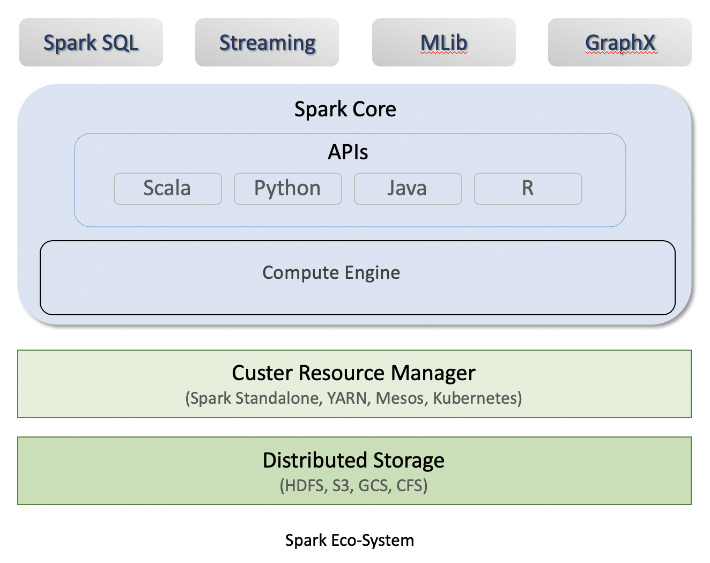
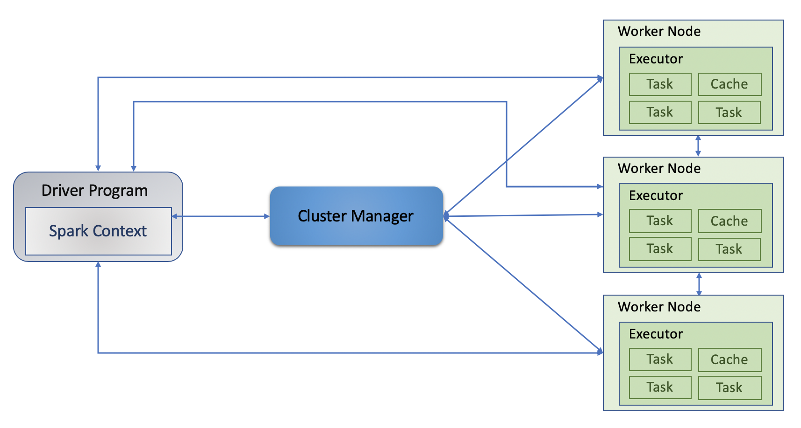
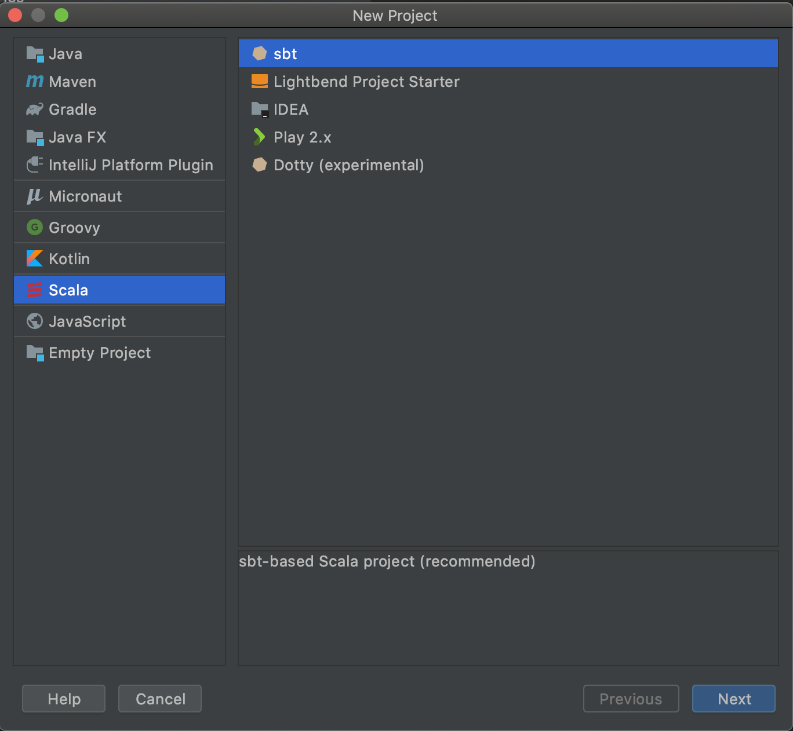
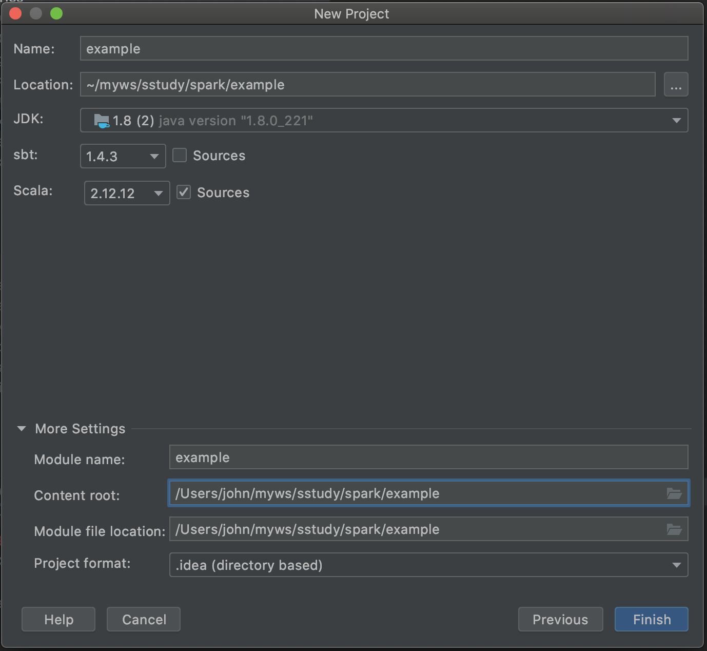
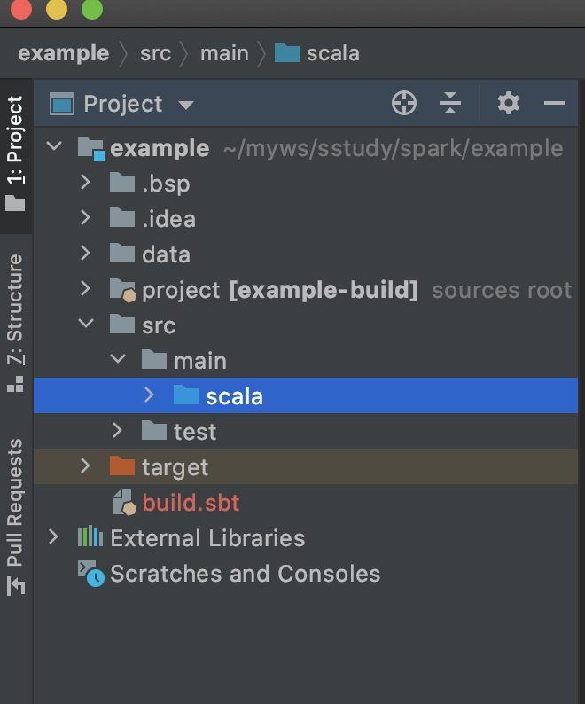
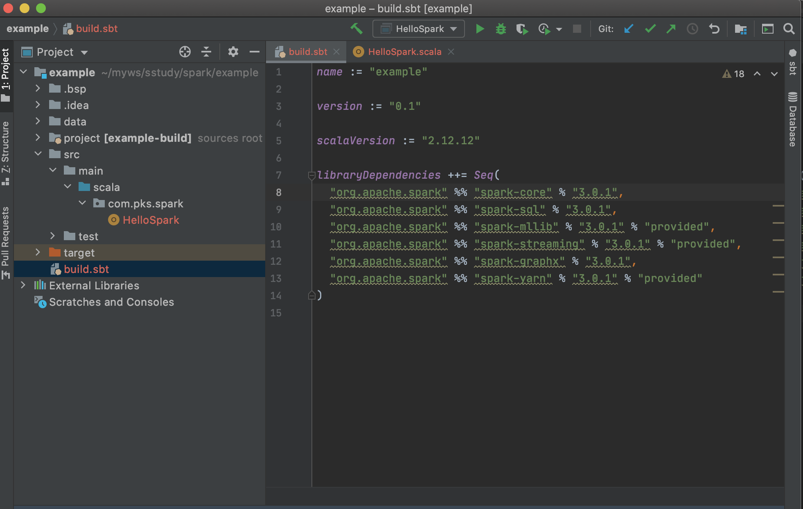
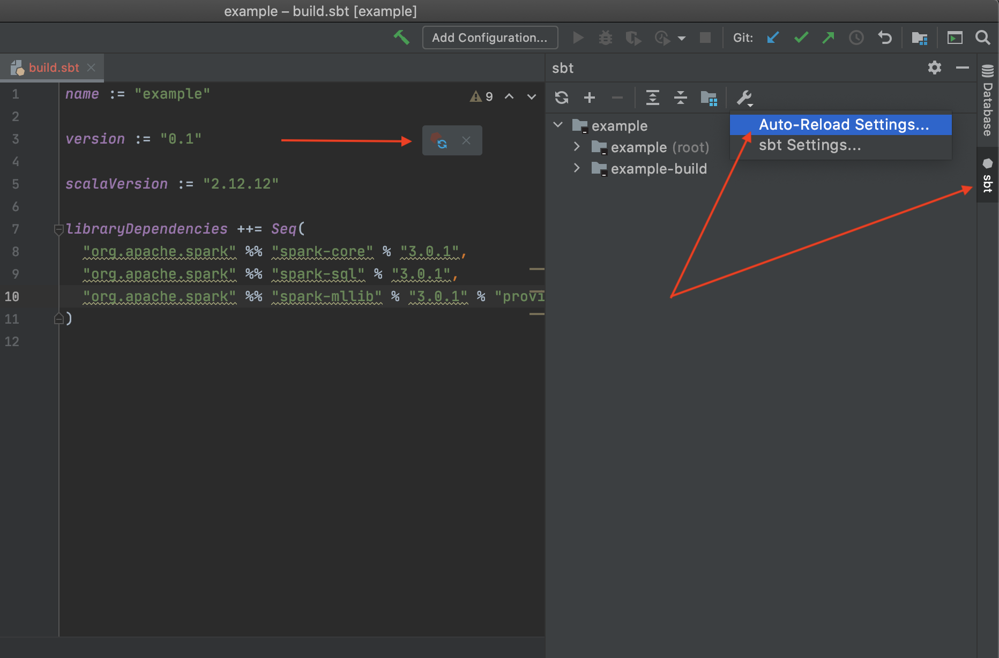
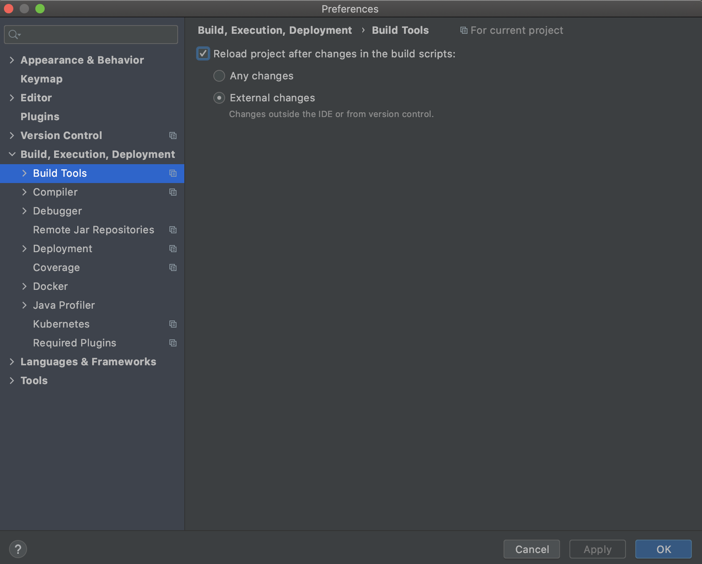

# Spark

## Table of Contents
- [Spark](#spark)
  - [Table of Contents](#table-of-contents)
  - [Overview](#overview)
  - [Features](#features)
    - [Lighting-fast processing speed](#lighting-fast-processing-speed)
    - [Ease of use](#ease-of-use)
    - [In-memory computing](#in-memory-computing)
    - [Real-time stream processing](#real-time-stream-processing)
    - [Generality](#generality)
    - [Runs Everywhere](#runs-everywhere)
  - [Spark Eco-System](#spark-eco-system)
      - [Architecture](#architecture)
  - [Install](#install)
    - [Mac](#mac)
  - [Spark Project setup](#spark-project-setup)
    - [IntelliJ IDEA](#intellij-idea)
    - [Run first program](#run-first-program)
  - [Reference](#reference)


## Overview
Apache Spark is a cluster computing platform designed to be fast and general purpose. 
Originally developed in the University of California’s (Berkeley) AMPLab, Spark was designed as a robust processing engine for Hadoop data, with a special focus on speed and ease of use
Spark provides an interface for programming entire clusters with implicit data parallelism and fault tolerance.

Spark is designed to be highly accessible, offering simple APIs in Python, Java, Scala,
and SQL, and rich built-in libraries. It also integrates closely with other Big Data
tools. In particular, Spark can run in Hadoop clusters and access any Hadoop data
source, including Cassandra.

## Features
Here are the features that make Spark one of the most extensively used

### Lighting-fast processing speed
The most important feature of Apache Spark is its speed. Apache Spark achieves high performance for both batch 
and streaming data, using a state-of-the-art DAG scheduler, a query optimizer, and a physical execution engine. 
Spark contains Resilient Distributed Datasets (RDDs) that save the time taken in reading and writing operations, 
and hence it runs almost 10–100 times faster than Hadoop.

### Ease of use
Spark offers over 80 high-level operators that make it easy to build parallel apps. And you can use it interactively 
from the *Scala*, *Python*, *R*, and *SQL* shells.

### In-memory computing
Spark stores data in the RAM of servers, which allows it to access data quickly, and in-turn this accelerates the speed of analytics.

### Real-time stream processing
Spark is able to process real-time streaming data. Unlike MapReduce, which processes the stored data, Spark is able to process 
the real-time data and hence is able to produce instant outcomes.

### Generality
Combine SQL, streaming, and complex analytics. Spark powers a stack of libraries including *SQL and DataFrames*, 
*MLlib* for machine learning, *GraphX*, and *Spark Streaming*. You can combine these libraries seamlessly in the same application.

### Runs Everywhere
Spark runs on Hadoop, Apache Mesos, Kubernetes, standalone, or in the cloud. It can access diverse data sources.

You can run Spark using its standalone cluster mode, on EC2, on Hadoop YARN, on Mesos, or on Kubernetes. Access data in HDFS, Alluxio, Apache Cassandra, Apache HBase, Apache Hive, and hundreds of other data sources.

## Spark Eco-System
The architecture of spark is depicted below: 


Spark is a distributed processing engine, but it does not have its own distributed storage and cluster manager for resources. It runs on top of out of the box cluster resource manager and distributed storage. 

Spark core contains two major components:
* **Core API**: The Unstructured APIs(RDDs), Structured APIs(DataFrames, Datasets). Available in Scala, Python, Java, and R
* **Compute Engine**: Memory Management, Task Scheduling, Fault Recovery, Interacting with Cluster Manager.

Spark also provides four important libraries/APIs:
* **Spark SQL**: Spark SQL is a Spark module for structured data processing. Unlike the basic Spark RDD API, the interfaces provided by Spark SQL provide Spark with more information about the structure of both the data and the computation being performed.
* **Streaming**: Spark Streaming is an extension of the core Spark API that Consume and Process a continuous stream of data. 
* **MLlib**: MLlib is Spark’s machine learning (ML) library. Its goal is to make practical machine learning scalable and easy.
* **GraphX**: GraphX is a new component in Spark for graphs and graph-parallel computation

#### Architecture 
The Spark follows the master-slave architecture. Its cluster consists of a single master and multiple slaves.
There are two abstraction in Spark architecture:
* Resilient Distributed Dataset (RDD)
* Directed Acyclic Graph (DAG)

**Resilient Distributed Datasets (RDD)**\
RDD is a distributed collection of elements that can be stored in-memory. In Spark every work is expressed as either 
creating a new RDD, transforming existing RDDs, calling action on RDDs to compute results.

- Resilient: Fault tolerant and is capable of restoring the data on failure.
- Distributed: Data is distributed among different nodes.
- Dataset: Collection of partitioned data  

Spark distributes the data contained in RDD across the cluster and parallelize the operations perform on them.

Each RDD is split into multiple partitions, which may be computed on different nodes of the cluster.

RDD is immutable, once created can't be changed but can be transformed any time.
After creating RDD there are two types of operations we can do:
* ***Transformation***, For example one common transformation is filtering data that matches a predicate.
* ***Action***, compute a result based on an RDD, and either return it to the driver program or save it to an external storage system (e.g., HDFS). One example of an action we called earlier is *first()*, which returns the first element in an RDD.


**Directed Acyclic Graph (DAG)**\
Directed Acyclic Graph, DAG is a finite direct graph that performs a sequence of computations on data. 
Each node is an RDD partition, and the edge is a transformation on top of data. Here, the graph refers the navigation 
whereas directed and acyclic refers to how it is done.

The DAG in Spark supports cyclic data flow. Every Spark job creates a DAG of task stages that will be executed on the cluster. Spark DAGs can contain many stages, 
unlike the Hadoop MapReduce which has only two predefined stages. In a Spark DAG, there are consecutive computation stages that optimize the execution plan. Spark DAG uses the Scala interpreter 
to interpret codes with the same modifications. When this code is entered in a Spark console, an operator graph is created. The DAG then divides the operators into stages in the DAG scheduler. 
The stages are passed to the Task scheduler, which is then launched through the Cluster manager.

RDD splits data into a partition, and every node operates on a partition. The composition of these operations together and the Spark execution engine views this as DAG.
When a node crashes in the middle of an operation, the cluster manages to find out the dead node and assigns another node to the process. This will prevent any data loss.

Transformations in RDD is lazily evaluated. That means when we call a transformation on a RDD, the operation doesn't perform immediately. Instead, Spark internally records metadata to indicate that this operation
has been requested. Loading data in RDD is lazily evaluated. 



## Install
### Mac
There are two ways you can install Spark, using Homebrew or download the Spark distribution
**Install using Homebrew**
1. [Install Homebrew](https://brew.sh/)
2. Install xcode
3. Install Java
    - Homebrew: `brew cask install java`
    - Download [JDK](https://www.oracle.com/java/technologies/javase-jdk11-downloads.html) and install.
4. Install [Scala](https://www.scala-lang.org/download/), 
    - Homebrew: `brew install scala`
    - Download [Scala](https://www.scala-lang.org/download/) binary, extract and add scala bin in the path: `PATH="/scala-2.13.3/bin:$PATH"`
5. Install Spark
    - Homebrew: `brew install apache-spark`
    - Download binary distribution of [Spark](https://spark.apache.org/downloads.html). Extract the content and add in environment variable. \
        `export PATH=/spark-3.0.1-bin-hadoop3.2/bin:$PATH`\
        `export SPARK_HOME='/spark-3.0.1-bin-hadoop3.2'`
 
Test Spark installation by running spark-shell:
`/spark-3.0.1-bin-hadoop3.2/bin/spark-shell`
You will see logs like below:
```
Using Spark's default log4j profile: org/apache/spark/log4j-defaults.properties
Setting default log level to "WARN".
To adjust logging level use sc.setLogLevel(newLevel). For SparkR, use setLogLevel(newLevel).
Spark context Web UI available at http://192.168.0.11:4040
Spark context available as 'sc' (master = local[*], app id = local-1605674528116).
Spark session available as 'spark'.
Welcome to
      ____              __
     / __/__  ___ _____/ /__
    _\ \/ _ \/ _ `/ __/  '_/
   /___/ .__/\_,_/_/ /_/\_\   version 3.0.1
      /_/
         
Using Scala version 2.12.10 (Java HotSpot(TM) 64-Bit Server VM, Java 1.8.0_221)
Type in expressions to have them evaluated.
Type :help for more information.

scala> 
```

## Spark Project setup
### IntelliJ IDEA
First create a new scala project, select sbt as build tool for the project. 

Select scala, sbt and java versions


It will create a project structure like bellow


Now add project dependencies, which are spark modules


If auto-load is enabled then dependencies will automaticaly download, otherwise you will  see a refreash icon on the right side when you change something in the **build.sbt** file. 




There is another way too load the dependencies from command line.
Go to the root of the project and run 
```
$ sbt update
```

### Run first program
First try to run a simple scala program
```scala
package com.pks.spark

object Hello extends App {
  println("Hello scala!")
}

$ Hello scala!
```

Now lets write a simple spark program that will count number of lines in a file.

```scala
package com.pks.spark

import org.apache.log4j.{Level, Logger}
import org.apache.spark.SparkContext

object HelloSpark {
  def main(args: Array[String]): Unit = {

    Logger.getLogger("org").setLevel(Level.ERROR)

    val sc = new SparkContext("local[*]", "HelloWorld")

    val lines = sc.textFile("data/paragraph.txt")

    val numLines = lines.count()

    println("The file has " + numLines + " lines.")

    sc.stop()
  }
}

$  The file has 214 lines.
```


https://grouplens.org/datasets/movielens/
## Reference
[1] [Apache Spark Documentation](https://spark.apache.org/docs/latest/)\
[2] [Learning Spark  Lightning-Fast Big Data Analysis by O'Reilly Media, Inc](https://www.oreilly.com/library/view/learning-spark/9781449359034/)
