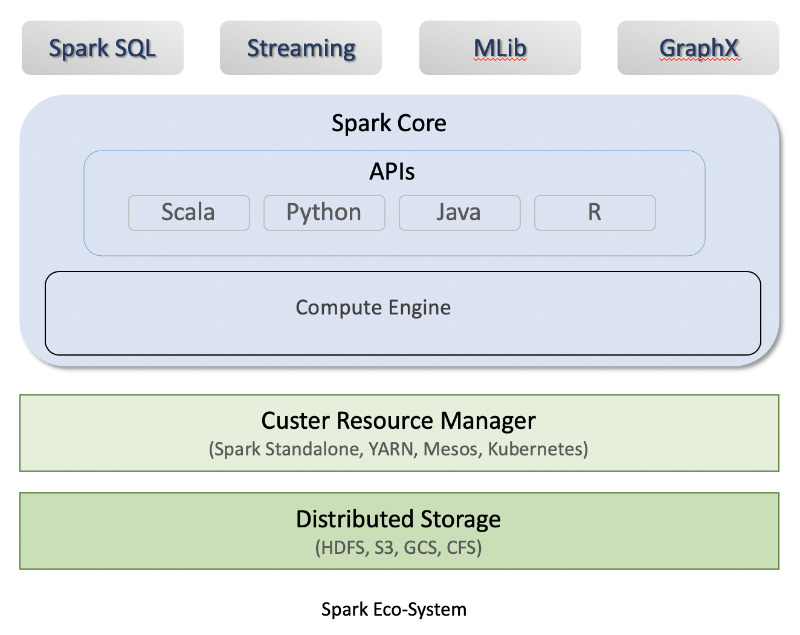

# Spark

## Table of Contents
- [Overview](#overview)
- [Features](#features)
- [Spark Eco-System](#spark-eco-system)
- [Architecture Overview](#architecture-overview)
- [Install Spark in local machine](#install-spark-in-local-machine)
- [Reference](#reference)

## Overview
Apache Spark is a cluster computing platform designed to be fast and general purpose. 
Originally developed in the University of California’s (Berkeley) AMPLab, Spark was designed as a robust processing engine for Hadoop data, with a special focus on speed and ease of use
Spark provides an interface for programming entire clusters with implicit data parallelism and fault tolerance.

Spark is designed to be highly accessible, offering simple APIs in Python, Java, Scala,
and SQL, and rich built-in libraries. It also integrates closely with other Big Data
tools. In particular, Spark can run in Hadoop clusters and access any Hadoop data
source, including Cassandra.

## Features
Here are the features that make Spark one of the most extensively used

### Lighting-fast processing speed
The most important feature of Apache Spark is its speed. Apache Spark achieves high performance for both batch 
and streaming data, using a state-of-the-art DAG scheduler, a query optimizer, and a physical execution engine. 
Spark contains Resilient Distributed Datasets (RDDs) that save the time taken in reading and writing operations, 
and hence it runs almost 10–100 times faster than Hadoop.

### Ease of use
Spark offers over 80 high-level operators that make it easy to build parallel apps. And you can use it interactively 
from the *Scala*, *Python*, *R*, and *SQL* shells.

### In-memory computing
Spark stores data in the RAM of servers, which allows it to access data quickly, and in-turn this accelerates the speed of analytics.

### Real-time stream processing
Spark is able to process real-time streaming data. Unlike MapReduce, which processes the stored data, Spark is able to process 
the real-time data and hence is able to produce instant outcomes.

### Generality
Combine SQL, streaming, and complex analytics. Spark powers a stack of libraries including *SQL and DataFrames*, 
*MLlib* for machine learning, *GraphX*, and *Spark Streaming*. You can combine these libraries seamlessly in the same application.

### Runs Everywhere
Spark runs on Hadoop, Apache Mesos, Kubernetes, standalone, or in the cloud. It can access diverse data sources.

You can run Spark using its standalone cluster mode, on EC2, on Hadoop YARN, on Mesos, or on Kubernetes. Access data in HDFS, Alluxio, Apache Cassandra, Apache HBase, Apache Hive, and hundreds of other data sources.

## Spark Eco-System
The architecture of spark is depicted below: 

Spark is a distributed processing engine, but it does not have its own distributed storage and cluster manager for resources. It runs on top of out of the box cluster resource manager and distributed storage. 

Spark core contains two major components:
* **Core API**: The Unstructured APIs(RDDs), Structured APIs(DataFrames, Datasets). Available in Scala, Python, Java, and R
* **Compute Engine**: Memory Management, Task Scheduling, Fault Recovery, Interacting with Cluster Manager.

Spark also provides four important libraries/APIs:
* **Spark SQL**: Spark SQL is a Spark module for structured data processing. Unlike the basic Spark RDD API, the interfaces provided by Spark SQL provide Spark with more information about the structure of both the data and the computation being performed.
* **Streaming**: Spark Streaming is an extension of the core Spark API that Consume and Process a continuous stream of data. 
* **MLlib**: MLlib is Spark’s machine learning (ML) library. Its goal is to make practical machine learning scalable and easy.
* **GraphX**: GraphX is a new component in Spark for graphs and graph-parallel computation

#### Architecture
The Spark follows the master-slave architecture. Its cluster consists of a single master and multiple slaves.
There are two abstraction in Spark architecture:
* Resilient Distributed Dataset (RDD)
* Directed Acyclic Graph (DAG)

**Resilient Distributed Datasets (RDD)**\
The Resilient Distributed Datasets are the group of data items that can be stored in-memory on worker nodes. Here,
- Resilient: Restore the data on failure.
- Distributed: Data is distributed among different nodes.
- Dataset: Group of data.

## Reference
[1] [Apache Spark Documentation](https://spark.apache.org/docs/latest/)\
[2] [Learning Spark  Lightning-Fast Big Data Analysis by O'Reilly Media, Inc](https://www.oreilly.com/library/view/learning-spark/9781449359034/)
